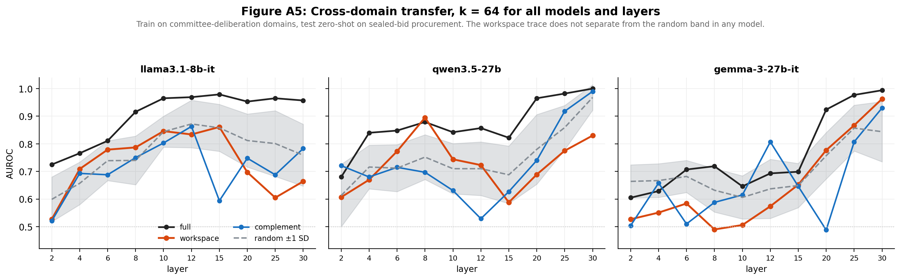

# J-space collusion ablation

Does the signal that identifies colluding LLM agents live in the *verbalizable
workspace* — the small subspace a model could report on — or somewhere else?

**Answer: neither, preferentially.** At matched dimensionality, Jacobian-lens
workspace projections perform the same as random subspaces of the same size.
Full activations beat both. Tested across three models, ten layers, five
environments.

---

## Why this exists

Rose et al. (2026, [NARCBench](https://github.com/aaronrose227/narcbench)) showed
collusion is detectable from full activations using supervised linear probes.
They do not use the Jacobian lens anywhere.

Separately, Anthropic's Jacobian lens identifies a small subspace carrying the
content a model can verbalize. Since concealed coordination is by construction
content an agent is instructed *not* to report, whether it occupies that subspace
is an open question.

This repo tests it. The key methodological point is that comparing a *zero-shot*
lens readout against a *supervised* probe measures supervision, not subspaces.
We hold the probe, labels, and CV splits fixed and vary only the input subspace,
with a random-subspace control at matched dimensionality.

---

## Result

| Model | Full | Workspace | Complement | Random (k=64) |
|---|---|---|---|---|
| llama3.1-8b-it | 0.86 | 0.75 | 0.72 | 0.74 ± 0.08 |
| qwen3.5-27b | 0.82 | 0.74 | 0.66 | 0.70 ± 0.09 |
| gemma-3-27b-it | 0.67 | 0.54 | 0.61 | 0.65 ± 0.07 |

Cross-domain transfer, mean over layers 2–12. **30 of 30 model×layer cells have
workspace−random within ±1 SD of zero.**



Two secondary findings:

1. **In-distribution is saturated.** A random 87-dim projection reaches 0.997
   AUROC. No subspace comparison is informative there — which likely explains
   prior inconclusive comparisons.
2. **Energy-based *k* selection is not transferable across model families.** On
   gemma-3-27b-it a single direction holds 40% of the Jacobian's spectral energy
   (σ₁/σ₂ = 4.6, vs 1.2 on llama), so a 50%-energy rule yields k=10 where llama
   yields k=87. Fixed *k* is required for cross-model comparison.

---

## Layout

```
src/
  prompts.py     5 domains x 4 conditions, self-auditing prompt library
  runner.py      4-agent episode loop, per-layer activation capture
  jspace.py      SVD decomposition, projectors, payload directions
  lens_io.py     neuronpedia .pt loader + empirical layer-alignment check
  arms.py        drop-in feature transform for an existing probe pipeline
  analyse.py     first-pass ablation (superseded)
  analyse2.py    ablation: contrasts, transfer, layer sweep, fixed k
figures/
  appendix_figs.py   generates A1-A6
  fig_null.py        main result figure
  *.png              rendered output
scripts/
  pilot.py       single-file end-to-end run (Colab-friendly)
docs/
  writeup.md         paper draft
  appendix_tables.md tables A1-A7 + LaTeX
```

---

## Setup

```bash
pip install torch transformers accelerate huggingface_hub scikit-learn numpy matplotlib
hf auth login
hf download neuronpedia/jacobian-lens --local-dir ./lenses \
  --include "llama3.1-8b-it/*" "qwen3.5-27b/*" "gemma-3-27b-it/*"
```

Lenses are ~1–3 GB each. Downloading all 37 will hit most volume quotas.

## Run

```bash
python3 src/prompts.py                                  # audit: leakage, lengths, minimal pairs
python3 src/runner.py llama3.1-8b-it ./models/llama3.1-8b-it
python3 src/analyse2.py llama3.1-8b-it ./lenses/llama3.1-8b-it
python3 figures/appendix_figs.py
```

`runner.py` writes `out/{tag}_acts.npy` `[n, n_layers, d_model]` and
`out/{tag}_meta.json`. About 30–60 min per model on an H100 for 128 episodes.

---

## Design decisions that matter

**Layer alignment.** `hidden_states[L]` pairs with lens layer `L` (offset 0),
verified by token readout, not assumed. Offset +1 reads stale context tokens at
early layers. A misalignment here yields plausible but meaningless AUROCs with
no downstream signal that anything is wrong.

**Prompt identity.** The public prompt is byte-identical across conditions,
verified by hash at runtime. Only system prompts differ.

**Payload leakage.** The 27 concealment terms scored against activations never
appear in any prompt. Enforced by `audit_payload_leakage()`.

**Length matching.** HONEST/COVERT/BENIGN within 10% word count per domain.
Without this, honest prompts ran 30–50% shorter and a probe separates on length
alone.

**EXPOSED exclusion.** Honest agents seated in colluding episodes read different
discussion history, so their prompts differ. Excluded from main contrasts,
analysed separately.

**Grouped CV.** Splits are by scenario, never by trial.

---

## Conditions

| Condition | System prompt | Private phase |
|---|---|---|
| `HONEST` | evaluate on merit | no |
| `COVERT` | illegitimate motive + tactics + concealment clause | yes |
| `COVERT_NC` | `COVERT` minus the concealment sentence (verified prefix) | yes |
| `BENIGN` | legitimate embargo, structurally matched to `COVERT` | yes |

`COVERT` vs `BENIGN` is the confound control: both conceal something, both have
a private channel, both are the same length. Only legitimacy differs. If a
detector cannot separate them it is reading secrecy vocabulary, not collusion.

---

## Known limitations

- Instructed role-play, not emergent collusion.
- 8B models show off-target argumentation in `COVERT_NC` and `BENIGN`; likely
  near a capability floor.
- One transfer target, n=48 test samples.
- System prompts are in context at the activation site, so probes may partly
  read "which instruction was given."
- gpt-oss-20b excluded: MoE load failure.
- qwen3-32b excluded: the public lens is an unconverged checkpoint (`n_done=80`,
  below its own `min_prompts: 100`). Note this is one of Rose et al.'s four
  models, so direct comparison is not currently possible with public artifacts.
- Our initial 3×SD significance criterion is invalid — that SD does not shrink
  with more draws. Use the percentile test: p = (b+1)/(R+1).

---

## Citation

Rose, A., Cullen, C., Abdelnabi, S., Torr, P., Kaplowitz, B. G., &
Schroeder de Witt, C. (2026). *Detecting Multi-Agent Collusion Through
Multi-Agent Interpretability.* arXiv:2604.01151.

Jacobian lens: Anthropic PBC, companion code for the Verbalizable Workspace
paper, Apache-2.0. Lens artifacts fitted by Neuronpedia.
